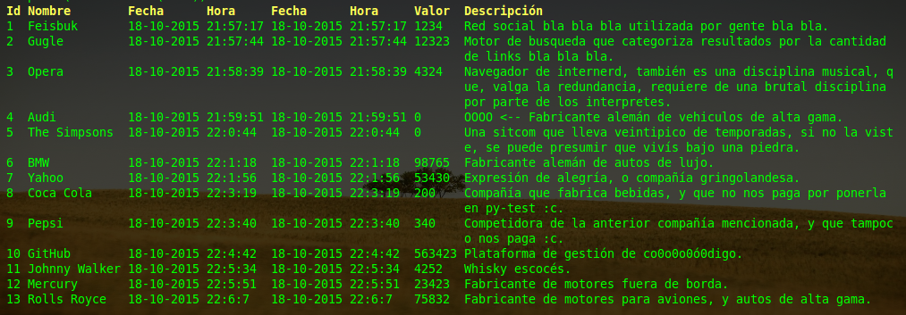
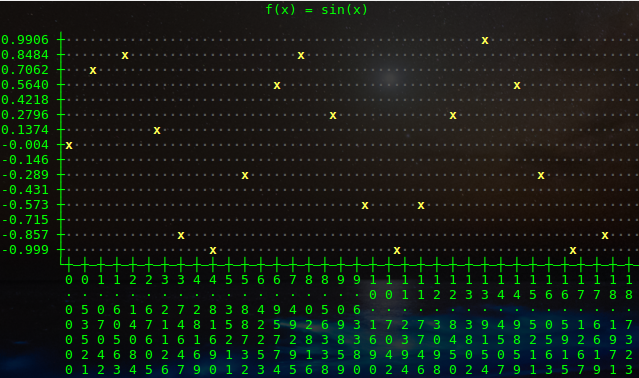

# outfancy

*Table printing and Line plotting in Terminal*

[](https://gitter.im/carlosplanchon/outfancy?utm_source=badge&utm_medium=badge&utm_campaign=pr-badge&utm_content=badge)



##Demonstration
- http://showterm.io/42f0bfa286232758acf18
- http://showterm.io/5a31927cbfdc37e116f8d

## what is it?
Outfancy is a Python3.6 library to print tables in Terminal. It's a quick way to visualize data when you don't have a GUI and can be integrated easily in your programs. It's written in Python 3.6 and can quickly be installed anywhere using pip.

## installation
### install with pip
```
$ pip install outfancy
```

## features

- Quick printing of tables.
- LineChart printing with linear interpolation.
- customize the separator used, width, priority of printing for each column.
- rearrange the columns in real time.
- Add labels above the table (can be autogenerated).
- Do Oneline printing, useful for real-time applications (report in screen function).
- Add colors to the field of the tables.

## usage
### In the interpreter
# Table.
```
import outfancy.table
table = outfancy.table.Table()
dataset = [(1, 'Marie'), (2, 'Joseph')]
print(table.render(dataset))
```

# Chart.
```
import outfancy.chart

from math import sin
line_chart = outfancy.chart.LineChart()

dataset = [(i, sin(i)) for i in range(10)]
line_chart.plot(dataset)
print(line_chart.render(color=True))
```

## To do (Colaboration is welcome)
- Translate code to english. (Translated) (the translation need revision from a native english speaker (I speak spanish).
- Improve interpolation function on outfancy.chart.LineChart

## Others
- https://gist.github.com/carlosplanchon/986c7c11a932a7206bb3 (Funny demo with colors)

## Experimental (Line plot)

- http://showterm.io/80074a1806e78205339d6
